# AWS Network Security - Diagramme d'Infrastructure

## Architecture Globale

```mermaid
flowchart TB
    subgraph Internet
        INT((🌐 Internet))
    end
    
    subgraph VPC["VPC - 10.0.0.0/16"]
        IGW[Internet Gateway]
        
        subgraph PublicSubnets["Subnets Publics - Web Tier"]
            PS1["Public-Subnet-AZ1<br/>10.0.1.0/24<br/>us-east-1a"]
            PS2["Public-Subnet-AZ2<br/>10.0.2.0/24<br/>us-east-1b"]
            NAT[NAT Gateway]
        end
        
        subgraph PrivateAppSubnets["Subnets Privés - App Tier"]
            PAS1["Private-App-AZ1<br/>10.0.3.0/24<br/>us-east-1a"]
            PAS2["Private-App-AZ2<br/>10.0.4.0/24<br/>us-east-1b"]
        end
        
        subgraph PrivateDBSubnets["Subnets Privés - DB Tier"]
            PDS1["Private-DB-AZ1<br/>10.0.5.0/24<br/>us-east-1a"]
            PDS2["Private-DB-AZ2<br/>10.0.6.0/24<br/>us-east-1b"]
        end
    end
    
    INT <--> IGW
    IGW <--> PS1
    IGW <--> PS2
    PS1 --> NAT
    NAT --> PAS1
    NAT --> PAS2
    PAS1 --> PDS1
    PAS2 --> PDS2
```

---

## Flux de Trafic


```mermaid
flowchart RL
    subgraph Outbound["Trafic Sortant"]
        D2[DB Tier] -->|Aucun| X1[❌ Bloqué]
        A2[App Tier] -->|Via NAT| I2[Internet]
        W2[Web Tier] -->|Via IGW| I3[Internet]
    end
```

---

## Route Tables

```mermaid
flowchart TB
    subgraph RT["Route Tables"]
        subgraph PRT["Public-Route-Table"]
            PR1["10.0.0.0/16 → local"]
            PR2["0.0.0.0/0 → IGW"]
        end
        
        subgraph ART["Private-App-Route-Table"]
            AR1["10.0.0.0/16 → local"]
            AR2["0.0.0.0/0 → NAT"]
        end
        
        subgraph DRT["Private-DB-Route-Table"]
            DR1["10.0.0.0/16 → local"]
            DR2["Pas de route Internet"]
        end
    end
    
    PRT -->|Associée à| PS["Subnets Publics"]
    ART -->|Associée à| PAS["Subnets App"]
    DRT -->|Associée à| PDS["Subnets DB"]
```

---

## Security Groups - Chaîne de Sécurité

```mermaid
flowchart TB
    INT((Internet)) -->|Port 80, 443, 22| WSG
    
    subgraph WSG["Web-Tier-SG"]
        W1["✅ TCP 80 from 0.0.0.0/0"]
        W2["✅ TCP 443 from 0.0.0.0/0"]
        W3["✅ TCP 22 from My IP"]
    end
    
    WSG -->|Port 8080, 22| ASG
    
    subgraph ASG["App-Tier-SG"]
        A1["✅ TCP 8080 from Web-SG"]
        A2["✅ TCP 22 from Web-SG"]
    end
    
    ASG -->|Port 3306| DSG
    
    subgraph DSG["Database-Tier-SG"]
        D1["✅ TCP 3306 from App-SG"]
    end
```

---

## Network ACL - DB Tier

```mermaid
flowchart LR
    subgraph NACL["Database-NACL"]
        subgraph Inbound["Règles Inbound"]
            IN1["Rule 100: ALLOW TCP 3306<br/>from 10.0.3.0/22"]
            IN2["Rule *: DENY ALL"]
        end
        
        subgraph Outbound["Règles Outbound"]
            OUT1["Rule 100: ALLOW TCP 1024-65535<br/>to 10.0.3.0/22"]
            OUT2["Rule *: DENY ALL"]
        end
    end
    
    APP["App Subnets<br/>10.0.3.0/24<br/>10.0.4.0/24"] -->|Port 3306| Inbound
    Outbound -->|Ports éphémères| APP
```

---

## Code par Étape

### Étape 1 : VPC

```mermaid
flowchart LR
    A[Début] --> B["create_vpc()"]
    B --> C["create_tags()"]
    C --> D["modify_vpc_attribute()"]
    D --> E[VPC Prêt]
```

**Code :**
```python
response = ec2.create_vpc(CidrBlock='10.0.0.0/16')
vpc_id = response['Vpc']['VpcId']

ec2.create_tags(Resources=[vpc_id], Tags=[{'Key': 'Name', 'Value': 'MyCustomVPC-Manual'}])

ec2.modify_vpc_attribute(VpcId=vpc_id, EnableDnsHostnames={'Value': True})
ec2.modify_vpc_attribute(VpcId=vpc_id, EnableDnsSupport={'Value': True})
```

---

### Étape 2 : Internet Gateway

```mermaid
flowchart LR
    A[Début] --> B["create_internet_gateway()"]
    B --> C["create_tags()"]
    C --> D["attach_internet_gateway()"]
    D --> E[IGW Attaché]
```

**Code :**
```python
response = ec2.create_internet_gateway()
igw_id = response['InternetGateway']['InternetGatewayId']

ec2.create_tags(Resources=[igw_id], Tags=[{'Key': 'Name', 'Value': 'MyCustomVPC-IGW'}])

ec2.attach_internet_gateway(InternetGatewayId=igw_id, VpcId=vpc_id)
```

---

### Étape 3 : Subnets

```mermaid
flowchart TB
    A[Début] --> B["create_subnet() x6"]
    B --> C["modify_subnet_attribute()<br/>Auto-assign IP publique"]
    C --> D[6 Subnets Prêts]
    
    subgraph Subnets
        S1["Public 1 - 10.0.1.0/24"]
        S2["Public 2 - 10.0.2.0/24"]
        S3["App 1 - 10.0.3.0/24"]
        S4["App 2 - 10.0.4.0/24"]
        S5["DB 1 - 10.0.5.0/24"]
        S6["DB 2 - 10.0.6.0/24"]
    end
```

**Code :**
```python
# Créer un subnet
response = ec2.create_subnet(
    VpcId=vpc_id,
    CidrBlock='10.0.1.0/24',
    AvailabilityZone='us-east-1a'
)
public_subnet_1 = response['Subnet']['SubnetId']

# Activer auto-assign IP (subnets publics seulement)
ec2.modify_subnet_attribute(SubnetId=public_subnet_1, MapPublicIpOnLaunch={'Value': True})
```

---

### Étape 4 : NAT Gateway

```mermaid
flowchart LR
    A[Début] --> B["allocate_address()"]
    B --> C["create_nat_gateway()"]
    C --> D["waiter.wait()"]
    D --> E[NAT Prêt]
```

**Code :**
```python
response = ec2.allocate_address(Domain='vpc')
eip_allocation_id = response['AllocationId']

response = ec2.create_nat_gateway(
    SubnetId=public_subnet_1,
    AllocationId=eip_allocation_id
)
nat_gw_id = response['NatGateway']['NatGatewayId']

waiter = ec2.get_waiter('nat_gateway_available')
waiter.wait(NatGatewayIds=[nat_gw_id])
```

---

### Étape 5 : Route Tables

```mermaid
flowchart TB
    A[Début] --> B["create_route_table()"]
    B --> C["create_route()"]
    C --> D["associate_route_table()"]
    D --> E[Route Table Prête]
    
    subgraph Routes
        R1["Public: 0.0.0.0/0 → IGW"]
        R2["App: 0.0.0.0/0 → NAT"]
        R3["DB: Pas de route Internet"]
    end
```

**Code :**
```python
# Créer Route Table
response = ec2.create_route_table(VpcId=vpc_id)
public_rt_id = response['RouteTable']['RouteTableId']

# Ajouter route vers Internet
ec2.create_route(
    RouteTableId=public_rt_id,
    DestinationCidrBlock='0.0.0.0/0',
    GatewayId=igw_id  # ou NatGatewayId=nat_gw_id
)

# Associer aux subnets
ec2.associate_route_table(RouteTableId=public_rt_id, SubnetId=public_subnet_1)
```

---

### Étape 6 : Security Groups


**Code - Web SG :**
```python
response = ec2.create_security_group(
    GroupName='Web-Tier-SG',
    Description='Security group for web servers',
    VpcId=vpc_id
)
web_sg_id = response['GroupId']

ec2.authorize_security_group_ingress(
    GroupId=web_sg_id,
    IpProtocol='tcp',
    FromPort=80,
    ToPort=80,
    CidrIp='0.0.0.0/0'
)
```

**Code - App/DB SG (depuis un autre SG) :**
```python
ec2.authorize_security_group_ingress(
    GroupId=app_sg_id,
    IpPermissions=[{
        'IpProtocol': 'tcp',
        'FromPort': 8080,
        'ToPort': 8080,
        'UserIdGroupPairs': [{'GroupId': web_sg_id}]
    }]
)
```

---

### Étape 7 : Network ACL

```mermaid
flowchart TB
    A[Début] --> B["create_network_acl()"]
    B --> C["create_network_acl_entry()<br/>Inbound"]
    C --> D["create_network_acl_entry()<br/>Outbound"]
    D --> E["replace_network_acl_association()"]
    E --> F[NACL Prêt]
```

**Code :**
```python
response = ec2.create_network_acl(VpcId=vpc_id)
db_nacl_id = response['NetworkAcl']['NetworkAclId']

# Inbound - Port 3306
ec2.create_network_acl_entry(
    NetworkAclId=db_nacl_id,
    RuleNumber=100,
    Protocol='6',
    RuleAction='allow',
    Egress=False,
    CidrBlock='10.0.3.0/22',
    PortRange={'From': 3306, 'To': 3306}
)

# Outbound - Ports éphémères
ec2.create_network_acl_entry(
    NetworkAclId=db_nacl_id,
    RuleNumber=100,
    Protocol='6',
    RuleAction='allow',
    Egress=True,
    CidrBlock='10.0.3.0/22',
    PortRange={'From': 1024, 'To': 65535}
)
```

---

## Ordre de Création

```mermaid
flowchart TB
    VPC["1. VPC"] --> IGW["2. Internet Gateway"]
    IGW --> SUB["3. Subnets (6)"]
    SUB --> NAT["4. NAT Gateway"]
    NAT --> RT["5. Route Tables (3)"]
    RT --> SG["6. Security Groups (3)"]
    SG --> NACL["7. Network ACL"]
    NACL --> DONE["✅ Infrastructure Complète"]
```

---

## Ordre de Suppression

```mermaid
flowchart TB
    NACL["1. Network ACL"] --> SG["2. Security Groups"]
    SG --> NAT["3. NAT Gateway"]
    NAT --> EIP["4. Elastic IP"]
    EIP --> RT["5. Route Tables"]
    RT --> SUB["6. Subnets"]
    SUB --> IGW["7. Internet Gateway"]
    IGW --> VPC["8. VPC"]
    VPC --> DONE["✅ Nettoyage Terminé"]
```

---

## Tags

#aws #mermaid #architecture #diagram #network #vpc

